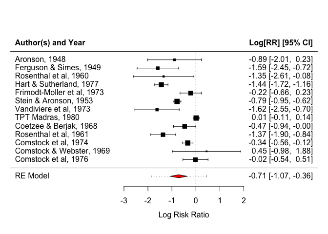

Metanálise em R - tutorial básico
================
Lino Sergio Rocha Conceição, PhD

# Meta-análise do efeito da vacinação para BCG

Nesse banco de dados vamos examinar o resultado de 13 estudos analisando
a efetividade da vacina Bacillus Calmette-Guerin (BCG) contra
tuberculose.

### 1. Instalando os pacotes necessários

Análises em **R** requerem a utilização de pacotes com as ferramentas
necessárias para a análise de dados. Nesse momento utlizaremos os pacote
**metafor**.

``` r
library("metafor")
```

    ## Loading required package: Matrix

    ## Loading required package: metadat

    ## Loading required package: numDeriv

    ## 
    ## Loading the 'metafor' package (version 4.2-0). For an
    ## introduction to the package please type: help(metafor)

### 2. Adicionando o banco de dados

Primeiro precisamos visualizar nosso banco de dados. O banco de dados
pode ser visualizado em **dat.bcg**. Para facilitar tanto a visualização
como a análise ao longo das linha de código, nos vamos renomear o banco
de dados.

``` r
print(dat.bcg)
```

    ##    trial               author year tpos  tneg cpos  cneg ablat      alloc
    ## 1      1              Aronson 1948    4   119   11   128    44     random
    ## 2      2     Ferguson & Simes 1949    6   300   29   274    55     random
    ## 3      3      Rosenthal et al 1960    3   228   11   209    42     random
    ## 4      4    Hart & Sutherland 1977   62 13536  248 12619    52     random
    ## 5      5 Frimodt-Moller et al 1973   33  5036   47  5761    13  alternate
    ## 6      6      Stein & Aronson 1953  180  1361  372  1079    44  alternate
    ## 7      7     Vandiviere et al 1973    8  2537   10   619    19     random
    ## 8      8           TPT Madras 1980  505 87886  499 87892    13     random
    ## 9      9     Coetzee & Berjak 1968   29  7470   45  7232    27     random
    ## 10    10      Rosenthal et al 1961   17  1699   65  1600    42 systematic
    ## 11    11       Comstock et al 1974  186 50448  141 27197    18 systematic
    ## 12    12   Comstock & Webster 1969    5  2493    3  2338    33 systematic
    ## 13    13       Comstock et al 1976   27 16886   29 17825    33 systematic

De agora em diante o banco de dados *dat.bcg* recebe o nome *dados*.
Para isso, basta apenas designar o banco de dados ao nome de sua
preferência.

Nesse caso teremos: dados \<- dat.bcg

### 3. Utilizando a função escalc

Essa função tem por objetivo calcular o tamanho do efeito de variáveis.
Esse passo é de fundamental importância para a metanálise. Essa função
esta integrada ao pacote ***metafor***, dessa forma, nenhuma instalação
adicional é necessária.

``` r
dados <- dados <- escalc(measure = "RR", ai = tpos, bi = tneg, 
                       ci = cpos, di = cneg,
       slab = paste(author, ", ", year, sep = ""), data = dat.bcg)
```

OBS: Para uma descrição detalhada da função ***escalc*** recomendamos a
função help(escalc).

### 4. Metanálise com análise de efeito randômico

Usaremos uma análise de efeito randômico (analise de variância e
logarítmica de risco). Também iremos renomear essa análise como fizemos
na etapa anterior com a função ***escalc***.

``` r
resultado <- rma(yi, vi, data = dados)
```

### 5. Criando o forest plot

Nessa etapa, conluiremos com forest plot de nossa análise. Se todas as
linhas de código anteriores estiverem corretas, a criação do forest plot
obedecerá uma linha de código simples. É importante que o leitor tenha
em mente que essa é apenas uma análise rápida e “crua”. Existem etapas
adicionais que certamente darão um rigor maior a análise dos dados.

``` r
forest(resultado)
```

<!-- -->

Podemos também adicionar outros comandos para deixar o forest plot mais
apresentável. Para inserir os título é necessário utulizar o argumento
*header*. Esse argumento pode ser um operador lógico (TRUE or FALSE), ou
pode ser uma **string** da sua escolha. No exemplo abaixo irei inserir
*“Author(s) and Year”*.

``` r
forest(resultado, header = "Author(s) and Year")
```

<!-- -->

### 5.1 Modificando a cor do diamante

É possivel fazer modificações mais específicas no forest plot. Aqui
modificaremos a cor do diamente. Essa abordagem não é muito comum, mas
pode auxiliar num destaque do tamanho de efeito final.

``` r
forest(resultado, header = "Author(s) and Year", col = "red")
```

<!-- -->

### 5.2. Adicionando a predição

É possivel adicionar predições por mei da função *predict.rma*. ela
calcula valores previstos, erros padrão correspondentes, intervalos de
confiança e intervalos de previsão da função **rma** (que foi renomeada
como *resultado*)

``` r
predict(resultado, transf = exp)
```

    ## 
    ##    pred  ci.lb  ci.ub  pi.lb  pi.ub 
    ##  0.4894 0.3441 0.6962 0.1546 1.5490

Agora vamos adicionar a predição dos valores obtidos no nosso forest
plot usando o argumento *addpred*

``` r
forest(resultado, header = "Author(s) and Year", col = "red", addpred = TRUE)
```

<!-- -->

### 5.3. Forest Plot com anotações adicionais

Existe uma grande variadedade de possibilidades para modificões nos
forest plot. Aqui mostraremos algumas que podem ser muito úteis e trazer
mais detalhes na análise.

``` r
forest(resultado, atransf = exp, at = log(c(.05, .25, 1, 4)), xlim = c(-16, 6),
       ilab = cbind(dados$tpos, dados$tneg, dados$cpos, dados$cneg), ilab.xpos = c(-9.5, -8, -6, -4.5),
       cex = .75, header = "Author(s) and Year", col = "red",
       addpred = TRUE)
op <- par(cex = .75, font = 2)
text(c(-9.5, -8, -6, -4.5), resultado$k + 2, c("TB+", "TB-", "TB+", "TB-"))
text(c(-8.75, -5.25),     resultado$k + 3, c("Vaccinated", "Control"))
```

<!-- -->

### 6. Considerações finais

A idéia básica desse tutorial foi apresentar de maneira rápida uma
metanálise realizada com o software R. Muitas outras análises e
adequações podem ser feitas. Para uma análise mais aprofundada nesse
tópico recomendamos esse [material
adicional](https://www.youtube.com/watch?v=IkduL5iRdqo&t=1362s).
